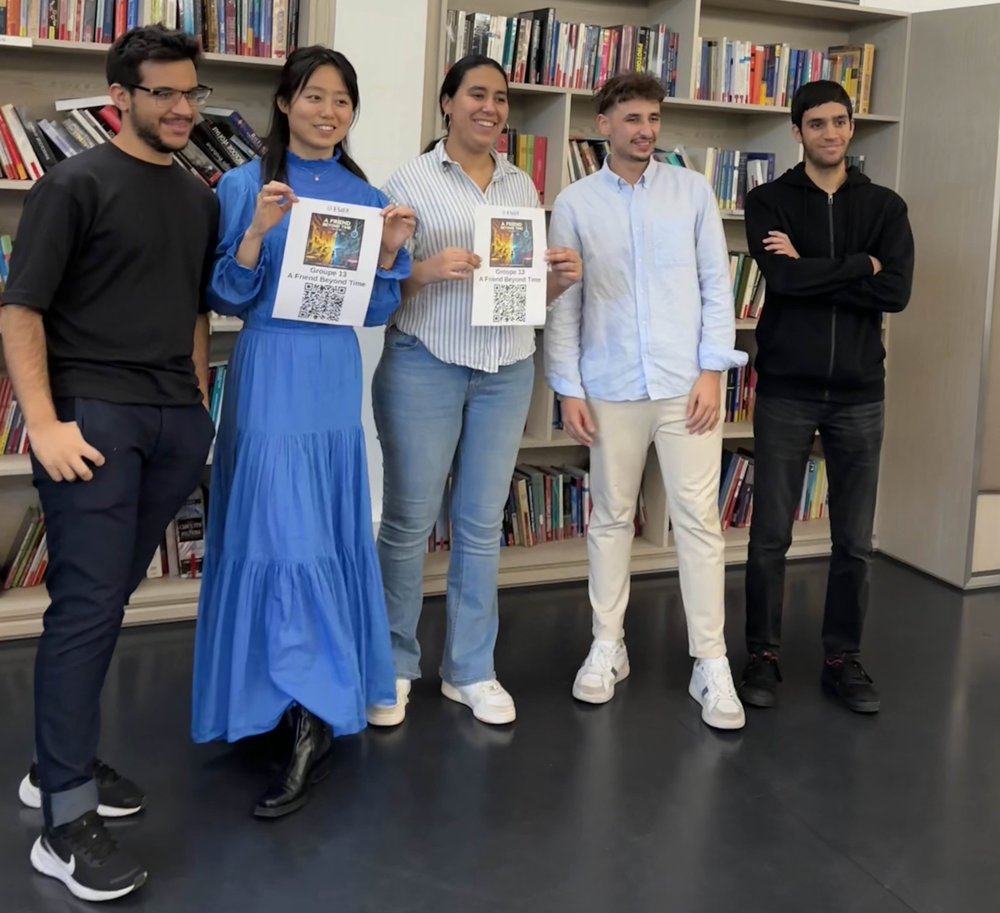

# ⏱️ A Friend Beyond Time

Dans le cadre de la Game Jam 2024 :

> 🖼️ Thème : "Manipuler le temps est la clé."

**L'amour, l'amitié et le pardon** sont des thèmes centraux de l'histoire de notre jeu. Le joueur doit naviguer à travers les différentes cartes pour retrouver son ami et réparer leur relation. En manipulant le temps, en collectant des indices et en évitant les dangers, le joueur doit surmonter les obstacles pour atteindre son objectif.

## 🔴 Vidéo de démo
   
 

> watch it on [Youtube](https://youtu.be/YIshMpHBr-I)

## 👩‍💻👨‍💻 Développeuses et développeurs 

<table border="0">
    <tr>
        <td>

- Berachem MARKRIA

- Abdallah M'CHIRI
- Manar DEHMANI
- Yue (Adèle) XIONG
- Ferhat RAMDANI
            ____________________________________
        </td>
        <td>
            
             ____________________________________
        </td>

    </tr>
</table>

<table>
  <tr>
 <td align="center">
    

</td>

   </tr>
   <tr>
   <td align="center">

   a.k.a. **BAMFY**

   </td>

</table>

## 📖 Scénario 

> Après une violente dispute avec ton meilleur ami, ce dernier disparaît sans laisser de traces. Rongé par le remords, tu décides de le retrouver pour t'excuser et réparer cette relation brisée. En te lançant à sa recherche, tu réalises que la réalité qui t'entoure est fracturée par le temps. Les environnements changent d'aspect en fonction de la temporalité, et seul un voyage à travers le passé et le présent te permettra de le retrouver.

## Cadre narratif :

Le passé représente la période avant la dispute, avec des paysages familiers mais marqués par des événements tragiques ou des changements importants.
Le présent est marqué par la solitude, les conséquences de la dispute, et des environnements plus hostiles où des ennemis et obstacles ont surgi.
Ton ami a laissé des indices (clés, lettres, objets) dans les différentes époques pour t'aider à le retrouver. Mais attention, le temps est limité, et tu devras jongler entre les deux temporalités pour surmonter les obstacles.

## 🎯 Objectif 

### Mission principale :

Retrouver ton ami avant que le temps ne s'épuise en récupérant des indices et en naviguant à travers plusieurs cartes tout en manipulant le temps pour éviter les obstacles et les ennemis.
Sous-objectifs :
Récupérer des clés pour déverrouiller des portes qui mènent à de nouveaux niveaux.
Lire des lettres laissées par ton ami, contenant des indices sur sa localisation et sur ce qu'il ressent après la dispute.
Éviter les ennemis et les pièges placés dans les deux temporalités.

### Mécanismes de jeu

1. **Changement de temporalité :**
   Le joueur peut utiliser la touche Espace pour passer entre le passé et le présent. Les deux temporalités présentent des environnements et des obstacles différents :
   Présent : Environnement plus hostile avec des ennemis actifs et des obstacles mécaniques (portes fermées, pièges). Certains chemins sont bloqués.
   Passé : Environnement plus calme, mais dégradé ou abandonné, avec des objets et des indices inaccessibles dans le présent.
2. **Temps imparti :**
   Chaque carte a une limite de temps pour être terminée. Si le joueur n’atteint pas la fin de la carte avant que le temps ne soit écoulé, il doit recommencer le niveau.
   Le joueur peut récupérer des objets de temps (montres, sabliers) pour regagner des secondes supplémentaires.
3. **Collecte d'indices :**
   Les clés permettent de débloquer des portes ou des passages spécifiques dans certaines cartes. Elles peuvent être cachées dans une temporalité ou l’autre.
   Les lettres laissées par ton ami racontent une histoire, donnent des indices et permettent de progresser émotionnellement dans la quête.
4. **Objets spécifiques à une temporalité :**
   Certains objets n’existent que dans une temporalité. Par exemple, une porte bloquée dans le passé pourrait être ouverte dans le présent, ou un pont effondré dans le présent pourrait être intact dans le passé.
5. **Ennemis et obstacles :**
   Présent : Des créatures hostiles ou des pièges automatiques bloquent le chemin. Les ennemis suivent des chemins spécifiques, et le joueur doit éviter ou contourner ces dangers.
   Passé : Moins d’ennemis actifs, mais des obstacles environnementaux comme des ruines ou des bâtiments effondrés bloquent le chemin.

## 🎮 Gameplay 

### ⌨️ Contrôles 

- **Déplacement :** Flèches directionnelles (gauche, droite, haut, bas)
- **Changer de temporalité :** Espace

### 🗝 Quêtes 

- **Réparer la voiture :** Trouver les pièces de la voiture pour la réparer et atteindre l'atelier de peinture où ton ami aime aller
- **Nourrir les chiens :** Trouver de la nourriture pour les chiens errants et les apaiser
- **Ramasser les drapeaux :** Collecter les drapeaux pour montrer ton soutien à ton ami

## Réalisation 

### Technologies

- **Arcades** : Librairie Python pour le développement de jeux vidéo en 2D.

### Maquette

